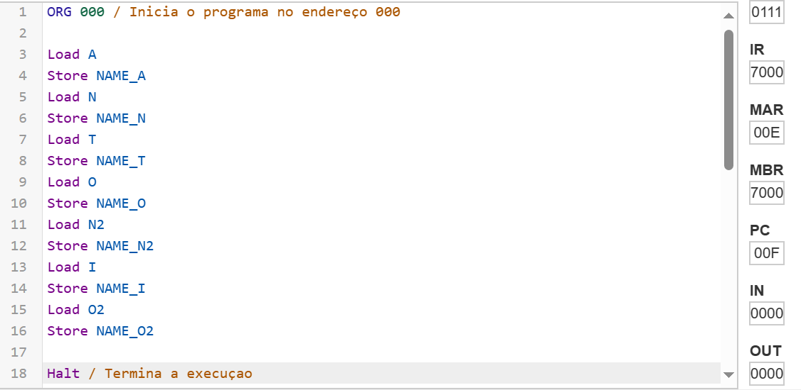
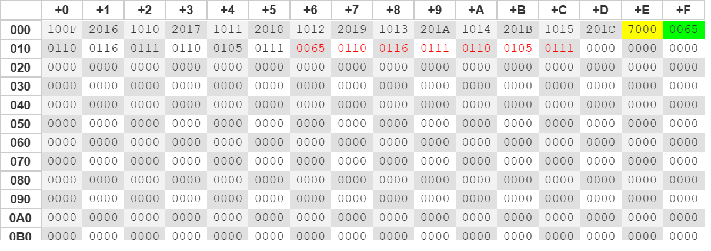
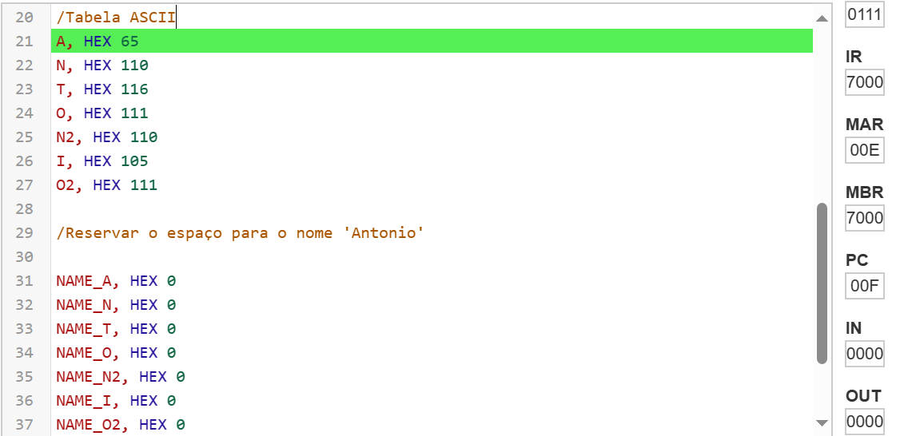

# Assembly

# 1° Atividade: Marie. JS

## Como funciona a alocaçao de memoria dinamica para armazenar seu nome 


**Definição da String:** Escolha a string que deseja armazenar.
**Alocação de Memória:** Use uma chamada de sistema específica para alocar memória.
**Cópia da String:** Copie a string para a região de memória alocada.
**Operações Adicionais (Opcional):** Execute qualquer operação adicional desejada, como imprimir a string.
**Finalização:** Encerre o programa, liberando recursos alocados, se necessário.

# Codigo 

``` sh 
ORG 000 / Inicia o programa no endereço 000

Load A
Store NAME_A
Load N
Store NAME_N
Load T
Store NAME_T
Load O
Store NAME_O
Load N2
Store NAME_N2
Load I
Store NAME_I
Load O2
Store NAME_O2

Halt / Termina a execuçao

/Tabela ASCII

A, HEX 65
N, HEX 110
T, HEX 116
O, HEX 111
N2, HEX 110
I, HEX 105
O2, HEX 111

/Reservar o espaço para o nome 'Antonio'


NAME_A, HEX 0
NAME_N, HEX 0
NAME_T, HEX 0
NAME_O, HEX 0
NAME_N2, HEX 0
NAME_I, HEX 0
NAME_O2, HEX 0
```  








# 2° Atividade: VsCode

Em assembly, programar para DOS envolve o uso de interrupções de software fornecidas pelo DOS para operações de entrada e saída. Por exemplo, para exibir uma mensagem na tela, você usaria a interrupção de software 21h. O código assembly para isso envolve definir a mensagem na memória e chamar a interrupção 21h para exibi-la.


# Codigo 
.MODEL Small ; Define o modelo de memoria small 
.STACK 64 ; Aloca um espaço/pilha de 64 bytes, espaço de alocaçao

.DATA ; Inicio da minha Instrucao

message db 'Da Rosa', '$'; Define uma mensagem e termina com $

.CODE ;  Inicio da secao de codigo
main proc ; Define o inicio do procedimento principal

mov ax, @data ; Carrega o endereco do segmenento em AX
mov ds, ax ; Move o vslor em AX para o registrador DS

mov ah, 9h ; Preparar o registrador AH para a funcao 09h do DOS
mov dx, offset message; vsi fazer o deslocamento da msg em DX

int 21h; Instrucao de Interrupcao

main endp ; Marca o fim 

end main ; indica o fim 

## Funcionamento dos Registradores

Os registradores são pequenas áreas de armazenamento dentro da unidade central de processamento (CPU) de um computador. Eles são usados para armazenar dados temporários e valores de controle durante a execução de programas.Cada processador possui um conjunto específico de registradores, e suas funções podem variar dependendo da arquitetura do processador. No entanto, existem alguns tipos comuns de registradores que são encontrados em muitas arquiteturas de CPU:

Registradores de dados (Data Registers): São usados para armazenar dados que estão sendo processados ou manipulados pela CPU. Eles incluem registradores de uso geral (como EAX, EBX, ECX, EDX em arquiteturas x86) e registradores de ponto flutuante (quando suportados pela arquitetura).

Registradores de endereço (Address Registers): São usados para armazenar endereços de memória. Eles incluem registradores de ponteiro (como ESP, EBP em arquiteturas x86) e registradores de índice (como ESI, EDI em arquiteturas x86).

Registradores de controle (Control Registers): São usados para controlar o funcionamento da CPU e do sistema. Eles incluem registradores de status (como o registrador de flags em arquiteturas x86) e registradores de controle de segmento (em arquiteturas x86).

Registradores de propósito específico (Special Purpose Registers): São usados para funções específicas, como contadores de programa, registradores de interrupção, registradores de temporização, entre outros.

